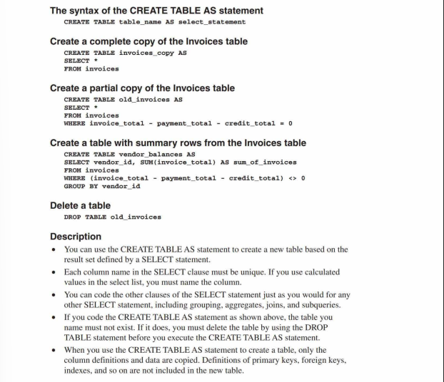
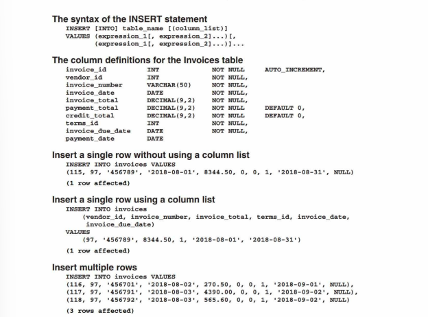
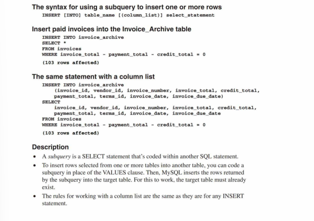
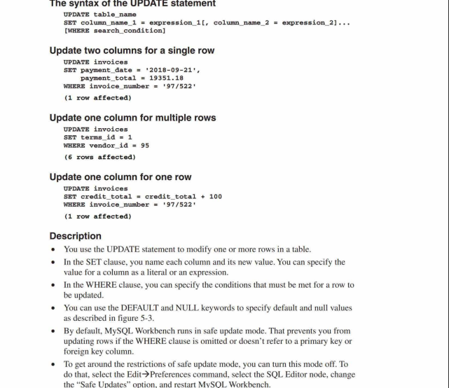
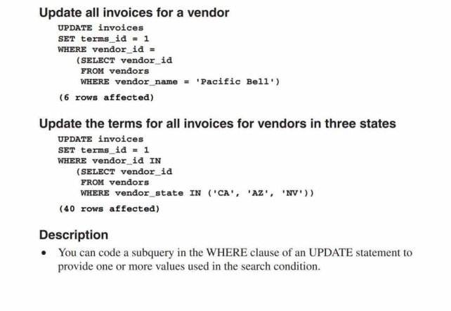
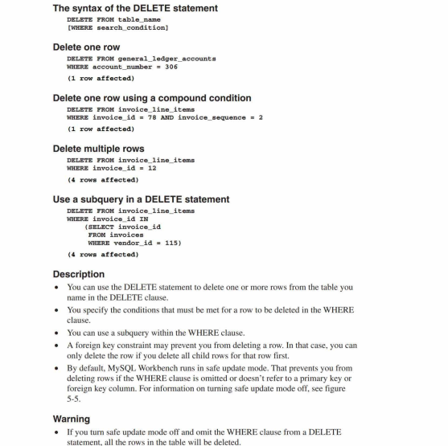
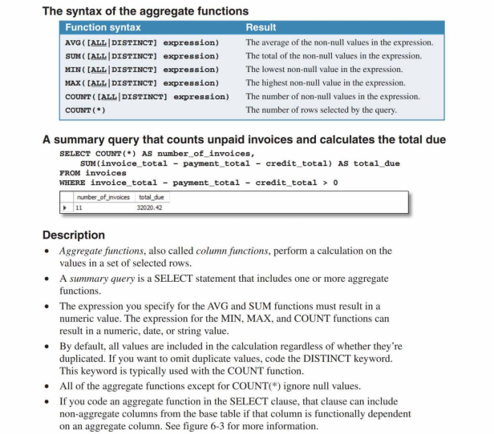
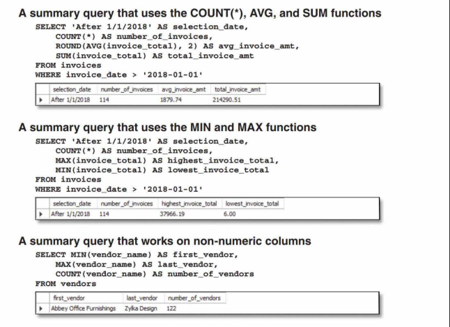
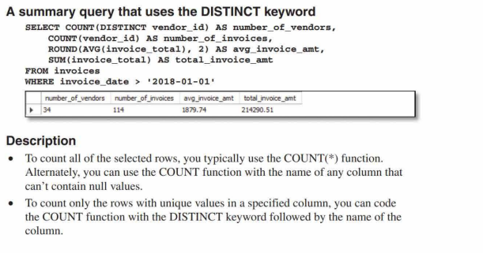
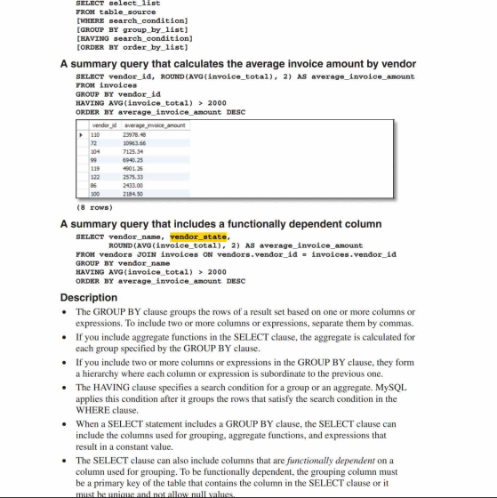

# MySQL Notes

## Key Concepts
1. **Backup Storage**:  
   To ensure data safety, servers typically utilize:
   - A **backup disk drive** for redundancy.
   - **Offline storage** for additional protection.

2. **Database Management Systems (DBMS)**:  
   Servers rely on DBMS tools like **MySQL** or **Microsoft SQL Server** to manage databases stored on them.

3. **Data Access**:  
   - Application programs interact with databases through the *data access* **API**.  
   - For **Java applications**, this API is known as **JDBC** (*Java Database Connectivity*).

---

## Primary Keys
- A **Composite Primary Key** is a primary key that consists of two or more columns.

---

## Indexing
- **Indexes** significantly enhance data retrieval efficiency by optimizing access to row values.  
- Since applications often use keys for data access, an index is automatically created for every key defined.
- If for example, we frequenty sort the rows by **ZIP Codes**, then we can define an **Index** for 
that column. Like a primary key, an index can contain more than one columns.

---
## How Tables Are Related  

- **Table Relationships**:  
  Tables are connected to each other using **keys**.  

- **Types of Keys**:  
  - **Primary Key**: A unique identifier for each record in a table.  
  - **Foreign Key**: A primary key from one table that is stored in another table to establish a relationship.  

- **Foreign Key Definition**:  
  The **primary key** of one table, when stored in another table, is referred to as the **foreign key** of that table.  

- If two tables have a 1-1 relationship, the  data of two tables can be stored in
  a single table.

- Many-Many Relationship is established by using an intermediate table that has
  a 1-Many relationship with the two tables in the many-many relationship.

- By making the **foreign key** enforce the *Refrential Integrity*, we can make
  sure that the value that we set in the foriegn cell is also present in the other
  tables primary key.

---
## How columns are defined
- Columns whose values are automatically generate by the **DBMS** are called
  **Auto-incremented columns**.
- **Columns Data Types:**
  - *CHAR, VCHAR: A string of letters, numbers or symbols.*
  - *INT, DECIMAL: Integer or Decimal numbers that contain exact values.*
  - *FLOAT: Floating-point numbers that contain approximate values.*
  - *DATE: Date & Time*

## Working with SQL statements
- The **select** statement is also called a query.
- The result of the **select** statement (query) is a **result
table** or **result set** that can have calculated values. It is 
also know as a **Logical Table**
- When an application requests data from the database it receives
a **Result Set**.

### *Joining data from two or more tables*
*A join lets us combine data from two or more tables and get back a resutl table or result set.*

*An **inner join** allows us to join data from two tables only
if the values of the columns in the **FROM** clause match.*

**EXAMPLE:**
```sql
SELECT vender_name, invoice_no, invoice_date, invoice_total
FROM vendors INNER JOIN invoices 
  ON vendors.vendor_id = invoices.invoice_id
WHERE invoice_total >= 500
ORDER BY vendor_name, invoice_total DESC 
```
---
### INSERT, UPDATE, DELETE data from tables
```sql
-- INSERT Statement
INSERT INTO invoices 
  (vendor_id, invoice_number, invoice_date, 
  invoice_total, terms_id, invoice_due_date) 
VALUES (12, 132891751 , '2018-07-18', 165, 3, ' 2018-08-17') 

-- UPDATE Statement
UPDATE invoices 
SET credit_total = 35.89 
WHERE invoice_number = '367447'

-- DELETE Statement
DELETE FROM invoices 
WHERE invoice_number = '4-342-8069'
```

## MySQL Coding Guidelines
- MySQL is a *case-insensitive* language.
- **CAPITALIZE** all keywords.
- Separate the words in names with *underscores*.
- Start each clause on a new line.
- Split long clauses into multiple lines and use 
indentation for continued lines.
--- 
## How to access database through an application program
To access MySQL database programming languages provide an API. These API classes use a **driver** to communicate with
the database server.

For some languages, the database driver is built-in while
for others it needs to be downloaded.

---
## Using MySQL Command line client
If you don't have MySQL Workbench installed on your system then you 
can use this command line tool to connect to the server and execute the queries.

| Option   | Usage    
|----------|----------
| -p       | To prompt for password    
| -h       | For host IP address or URL
| -u       | For specifying username

```bash
cd <path_to_mysql_executale_file>
mysql -u root -p
Password>
```
Or

```bash
cd <path_to_mysql_executale_file>
mysql -h murach.com -u root -p
Password>
```

For localhost
```bash
cd <path_to_mysql_executale_file>
# Any of these two command will work fine.
mysql -h localhost -u root -p
mysql -u root -p    
Password>            
```
---
To view the avaiable databases
```sql
show databases;
```
To select a database

```sql
use database_name;
```
---
## Basic MySQL Statments
1. ```select```


**Expanded Syntax**


**Using Aliases**


**Arithematic Operators**


**```Concat()``` function**


### Using functions with ```strings```, ```dates``` and ```numbers```
- The ```LEFT()``` function operates on strings. It returns the number of characters from the string.
- The ```DATE_FORMAT()``` function operates on dates. It formats
the date according to the specified format.
- The ```ROUND()``` function operates on numbers. The second parameter specifies how many decimal places to keep, if omitted
rounds the number to the nearest value.


## Testing expressions & functions without using ```FROM``` clause
This is useful to test expressions before you use them in actual
queries using the ```FROM``` clause.

Here, the ```CURRENT_DATE()``` function returns the current date.
The paranthesis are optional for this function.


We can eleminate the duplicated (identical) rows from the result set by using the ```DISTINCT``` keyword. Code it immediately after the ```SELECT``` clause. 

```DISTINCTROW``` is the same as ```DISTINCT```.

There is also another keyword ```ALL``` which is used by default when we use the ```SELECT```
clause.

## How to code the ```WHERE``` clause

- We can use comparison operators to compare values of unlike datatype e.g, '7' = 7.
- MySQL is case-insensitive for strings 'CA' is same as 'ca'.
But we can use ```CAST()``` or ```CONVERT()``` functions to cast as well.
- To test for null values use ```IS NULL```.
- When one of the parameters of the comparison is null the result
will always be a null value.


With logical operators


With the ```IN``` keyword


With the ```BETWEEN``` keyword

The lower and upper values of the range are inclusive.


---

Using ```LIKE``` & ```REGEXP```

The ```LIKE``` is an older operator that allows us to match simple strings.


Using ```IS NULL```
```NULL``` is not the same as ```empty string ""```.


Using ```ORDER BY``` clause

Here, in the below image in the last example, the rows are sorted first by state in ascending order then by city in ascending order and then by name in ascending order.

Ascending order is the default sorting order.


We can also use the column numbers to specify the sort.

**For Example:** 
In this figure below we have used columns numbers where 2 represents the 2nd column which is the concatenation of 3 columns and the by first column which is the name.

We can also use the aliases in the ```ORDER BY``` clause
```sql
SELECT CONCAT(vendor_name, ' ', vendor_address) 
AS vendor_info
FROM vendors
ORDER BY vendor_info, vendor_id; -- Here, we've used alias
```

---

## Working with the ```LIMIT``` clause


---

## How to work with ìnner joins

*A Join lets us combine the results of two or more tables in a single **result set**.*


## How to use table aliases
A table alias is typically as a single character or two characters. Used to shorten the table name.


## Join tables from different databases
MySQL databases are sometimes called ```schemas```.
To use the table of another database prefix the name of the table with database name.


## Using self join
We need to qualify the volumn names with the aliases here.


## Implicit INNER JOIN


## Explicit Outer Joins
*Outer Join returns all the rows regardless of whether the join condition is true.*

The ```OUTER``` keyword is optional and is usually omitted.

It returns all the matched rows of condition plus the umatched rows from the first(LEFT) or second(RIGHT) table 
based on specification.


## Join tables with ```USING``` & ```NATURAL``` keyword


WE don't specify the column name when using the ```NATURAL``` keyword. Database automaticall picks the 
columns that are common in both tables. If there are more than one common column then the database also includes those in the join.


## Using ```CROSS JOINS```


## Using ```UNIONS```
*Unions are like joins except that they combine rows from two **Result sets.***


A **Full Outer Join** using ```UNIONS```


---


## ```CREATE```, ```UPDATE``` & ```DELETE```
### Creating a copy of table
*We can create a copy of a tabel as follows but when we do this MySQL does not retain inforamtion about primary keys, foreign keys and indexes etc. It only copies the data into the tables.*

```sql
CREATE TABLE employees_copy AS
SELECT * FROM employees; 
```


The ```INSERT``` statment
We can use the ````DEFAULT``` keyword to make SQL 
set a default value for us.


We can also use a subquery with the ```INSERT``` statement.

**NOTE:** We donot enclose the select statement in paranthesis when using with ```INSERT``` statment like we would do with ```UPDATE``` or ```SELECT``` statment.

```sql
INSERT INTO EMPLOYEES (emp_id, emp_name, emp_salary)
SELECT (emp_id, emp_name, emp_salary) FROM employees_copy;
```



### ```UPDATE``` query


With subquery




### ```DELETE``` query
If we omit the ```WHERE``` clause it deletes all the rows.
We cannot delete rows whose primary key is used as a foreign key in other tables. First we need to delete those. Also in safe mode, MySQL workbench prevents us to use the ```DELETE``` clause if ```WHERE``` clause is not used or the primary or the foreign key is not used.


---

## Working with Aggregate functions
*Functions that operate on a series of values and return a single value are known as **Aggregate functions.***

*A query that contains one or more aggregate functions is known as **Summary Query.***

Typically, these functions take a column name but can also take complex expressions.

**Aggregate functions** except for the `COUNT(*)` exclude ```null``` values. The ```COUNT(*)``` function with `*` in it counts the rows with null values as well.







## The `GROUP BY` & `HAVING` clause
- The `GROUP BY` clause determines how the rows are group.
- The `HAVING` clause determines which groups are included in the final result.

The `SELECT` clause in SQL, when used with a `GROUP BY` clause, generally includes only:

1. Columns that are part of the `GROUP BY` clause.
2. Aggregate functions like `SUM`, `COUNT`, `AVG`, etc.
3. Expressions that result in a constant value.
4. Columns that are **functionally dependent** on a grouping column.

### **Functional Dependency Explained**
A column is **functionally dependent** on another column if:
- The column used for grouping is a **primary key** for the other column.
- OR the grouping column is **unique** and does not allow null values (acts like a primary key).

### **Example with Explanation**

#### Table: `Orders`

| OrderID | CustomerID | CustomerName | OrderDate   | TotalAmount |
|---------|------------|--------------|-------------|-------------|
| 1       | 101        | Alice        | 2024-01-01  | 100         |
| 2       | 102        | Bob          | 2024-01-02  | 200         |
| 3       | 101        | Alice        | 2024-01-03  | 150         |
| 4       | 103        | Charlie      | 2024-01-04  | 300         |

- `OrderID` is the primary key for this table.
- `CustomerID` is unique and identifies a customer (`CustomerName` is functionally dependent on `CustomerID`).

#### Query Example

```sql
SELECT CustomerID, CustomerName, SUM(TotalAmount) AS TotalSpent
FROM Orders
GROUP BY CustomerID;
```

#### Explanation:
1. **`CustomerID`**: Included in the `GROUP BY` clause for grouping.
2. **`SUM(TotalAmount)`**: An aggregate function.
3. **`CustomerName`**: Included because it is **functionally dependent** on `CustomerID`.
   - `CustomerID` is unique, and `CustomerName` is determined by it.

#### Result:

| CustomerID | CustomerName | TotalSpent |
|------------|--------------|------------|
| 101        | Alice        | 250        |
| 102        | Bob          | 200        |
| 103        | Charlie      | 300        |

#### Adding Constant Expressions

You can also add a constant expression:

```sql
SELECT CustomerID, 'FixedValue' AS ConstantColumn, SUM(TotalAmount) AS TotalSpent
FROM Orders
GROUP BY CustomerID;
```

#### Result:

| CustomerID | ConstantColumn | TotalSpent |
|------------|----------------|------------|
| 101        | FixedValue     | 250        |
| 102        | FixedValue     | 200        |
| 103        | FixedValue     | 300        |

### Key Takeaways
- You can include additional columns in the `SELECT` clause only if they are functionally dependent on the grouping columns.
- Adding unrelated columns or non-dependent columns will result in an SQL error unless those columns are part of an aggregate function.




---
[Visit Repository](https://github.com/Zeeshan-R9/MYSQLNotes.git)
