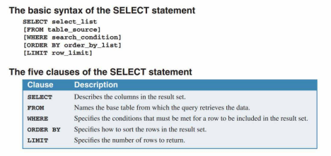
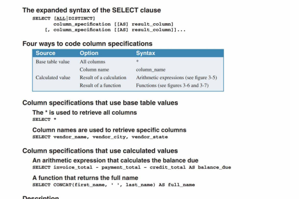
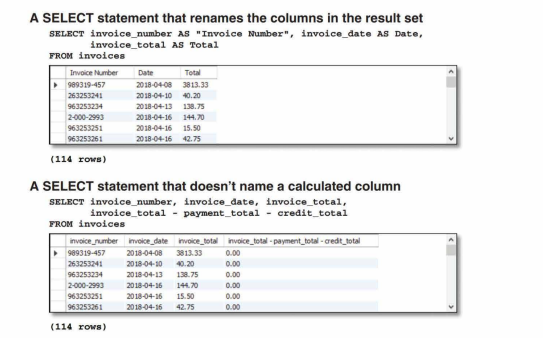

# MySQL Notes

## Key Concepts
1. **Backup Storage**:  
   To ensure data safety, servers typically utilize:
   - A **backup disk drive** for redundancy.
   - **Offline storage** for additional protection.

2. **Database Management Systems (DBMS)**:  
   Servers rely on DBMS tools like **MySQL** or **Microsoft SQL Server** to manage databases stored on them.

3. **Data Access**:  
   - Application programs interact with databases through the *data access* **API**.  
   - For **Java applications**, this API is known as **JDBC** (*Java Database Connectivity*).

---

## Primary Keys
- A **Composite Primary Key** is a primary key that consists of two or more columns.

---

## Indexing
- **Indexes** significantly enhance data retrieval efficiency by optimizing access to row values.  
- Since applications often use keys for data access, an index is automatically created for every key defined.
- If for example, we frequenty sort the rows by **ZIP Codes**, then we can define an **Index** for 
that column. Like a primary key, an index can contain more than one columns.

---
## How Tables Are Related  

- **Table Relationships**:  
  Tables are connected to each other using **keys**.  

- **Types of Keys**:  
  - **Primary Key**: A unique identifier for each record in a table.  
  - **Foreign Key**: A primary key from one table that is stored in another table to establish a relationship.  

- **Foreign Key Definition**:  
  The **primary key** of one table, when stored in another table, is referred to as the **foreign key** of that table.  

- If two tables have a 1-1 relationship, the  data of two tables can be stored in
  a single table.

- Many-Many Relationship is established by using an intermediate table that has
  a 1-Many relationship with the two tables in the many-many relationship.

- By making the **foreign key** enforce the *Refrential Integrity*, we can make
  sure that the value that we set in the foriegn cell is also present in the other
  tables primary key.

---
## How columns are defined
- Columns whose values are automatically generate by the **DBMS** are called
  **Auto-incremented columns**.
- **Columns Data Types:**
  - *CHAR, VCHAR: A string of letters, numbers or symbols.*
  - *INT, DECIMAL: Integer or Decimal numbers that contain exact values.*
  - *FLOAT: Floating-point numbers that contain approximate values.*
  - *DATE: Date & Time*

## Working with SQL statements
- The **select** statement is also called a query.
- The result of the **select** statement (query) is a **result
table** or **result set** that can have calculated values. It is 
also know as a **Logical Table**
- When an application requests data from the database it receives
a **Result Set**.

### *Joining data from two or more tables*
*A join lets us combine data from two or more tables and get back a resutl table or result set.*

*An **inner join** allows us to join data from two tables only
if the values of the columns in the **FROM** clause match.*

**EXAMPLE:**
```sql
SELECT vender_name, invoice_no, invoice_date, invoice_total
FROM vendors INNER JOIN invoices 
  ON vendors.vendor_id = invoices.invoice_id
WHERE invoice_total >= 500
ORDER BY vendor_name, invoice_total DESC 
```
---
### INSERT, UPDATE, DELETE data from tables
```sql
-- INSERT Statement
INSERT INTO invoices 
  (vendor_id, invoice_number, invoice_date, 
  invoice_total, terms_id, invoice_due_date) 
VALUES (12, 132891751 , '2018-07-18', 165, 3, ' 2018-08-17') 

-- UPDATE Statement
UPDATE invoices 
SET credit_total = 35.89 
WHERE invoice_number = '367447'

-- DELETE Statement
DELETE FROM invoices 
WHERE invoice_number = '4-342-8069'
```

## MySQL Coding Guidelines
- MySQL is a *case-insensitive* language.
- **CAPITALIZE** all keywords.
- Separate the words in names with *underscores*.
- Start each clause on a new line.
- Split long clauses into multiple lines and use 
indentation for continued lines.
--- 
## How to access database through an application program
To access MySQL database programming languages provide an API. These API classes use a **driver** to communicate with
the database server.

For some languages, the database driver is built-in while
for others it needs to be downloaded.

---
## Using MySQL Command line client
If you don't have MySQL Workbench installed on your system then you 
can use this command line tool to connect to the server and execute the queries.

| Option   | Usage    
|----------|----------
| -p       | To prompt for password    
| -h       | For host IP address or URL
| -u       | For specifying username

```bash
cd <path_to_mysql_executale_file>
mysql -u root -p
Password>
```
Or

```bash
cd <path_to_mysql_executale_file>
mysql -h murach.com -u root -p
Password>
```

For localhost
```bash
cd <path_to_mysql_executale_file>
# Any of these two command will work fine.
mysql -h localhost -u root -p
mysql -u root -p    
Password>            
```
---
To view the avaiable databases
```sql
show databases;
```
To select a database

```sql
use database_name;
```
---
## Basic MySQL Statments
1. ```select```



**Expanded Syntax**


**Using Aliases**



---
[Visit Repository](https://github.com/Zeeshan-R9/MYSQLNotes.git)
